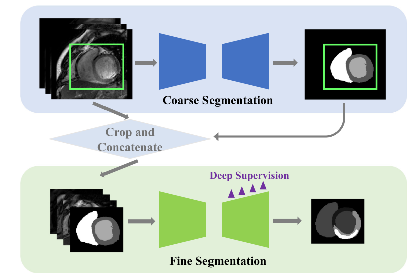

# Winner of MyoPS 2020 Challenge
[PyMIC_link]:https://github.com/HiLab-git/PyMIC
[nnUNet_link]:https://github.com/MIC-DKFZ/nnUNet
This repository provides source code for myocardial pathology segmentation (MyoPS) Challenge 2020. The method is detailed in the [paper](https://link.springer.com/chapter/10.1007/978-3-030-65651-5_5), and it won the 1st place of [MyoPS 2020](http://www.sdspeople.fudan.edu.cn/zhuangxiahai/0/myops20). Our code is based on [PyMIC][PyMIC_link], a pytorch-based toolkit for medical image computing with deep learning, that is lightweight and easy to use, and [nnUNet][nnUNet_link], a self-adaptive segmentation method for medical images.
```
@inproceedings{zhai2020myocardial,
  title={Myocardial edema and scar segmentation using a coarse-to-fine framework with weighted ensemble},
  author={Zhai, Shuwei and Gu, Ran and Lei, Wenhui and Wang, Guotai},
  booktitle={Myocardial Pathology Segmentation Combining Multi-Sequence CMR Challenge},
  pages={49--59},
  year={2020},
  organization={Springer}
}
```


## Method overview
Our solution is a coarse-to-fine method. [PyMIC][PyMIC_link] and [nnUNet][nnUNet_link] are used in the coarse and fine stages, respectively. 

In the coarse segmentation stage, we use 2D U-Net to segment there foreground classes: complete ring-shaped myocardium, left ventricular (LV) blood pool and rigth ventricular (RV) blood pool. The network is trained with a combination of Dice loss and cross entropy loss.

In the fine stage, we use nn-UNet to segment all the five foreground classes: LV blood pool, RV blood pool, LV normal myocardium, LV myocardial edema and LV myocardial scar. The coarse segmentation result will serve as an extra channel for the input of the network, i.e., the first 3 modalities are C0(_0000), DE(_0001) and T2(_0002), respectively. The 4th modality(_0003) is the coarse segmentation result. 

## Requirements
This code depends on [Pytorch](https://pytorch.org), [PyMIC][PyMIC_link] and [nnUNet][nnUNet_link].
To install PyMIC, run:
```
pip install PYMIC=0.2.4
``` 
To use nnUNet, Download [nnUNet][nnUNet_link], and put them in the `ProjectDir` such as `/mnt/data1/swzhai/projects/MyoPS2020`.
Other requirements can be found in [`requirements.txt`][`./requirements.txt`].

## Configure data directories and environmental variables
* Configure data directories in `path_confg.py` based on your environment:
``` bash
path_dict['MyoPS_data_dir'] = "/mnt/data1/swzhai/dataset/MyoPS/"
path_dict['nnunet_raw_data_dir'] = "/mnt/data1/swzhai/dataset/MyoPS/nnUNet_raw_data_base/nnUNet_raw_data"
```
where `MyoPS_data_dir` is the path of the MyoPS dataset, and `nnunet_raw_data_dir` is the path of raw data used by nnU-Net in the second stage of our method.
* Install [nnUNet][nnUNet_link] and set environment variables.
```bash
cd nnUNet
pip install -e .
export nnUNet_raw_data_base="DataDir/nnUNet_raw_data_base"
export nnUNet_preprocessed="DataDir/nnUNet_preprocessed"
export RESULTS_FOLDER="ProjectDir/result/nnunet"

# in my case
export nnUNet_raw_data_base="/mnt/data1/swzhai/dataset/MyoPS/nnUNet_raw_data_base"
export nnUNet_preprocessed="/mnt/data1/swzhai/dataset/MyoPS/nnUNet_preprocessed"
export RESULTS_FOLDER="/mnt/data1/swzhai/projects/MyoPS/myops/result/nnunet"
```

## Dataset and Preprocessing
* Download the dataset from [MyoPS 2020](http://www.sdspeople.fudan.edu.cn/zhuangxiahai/0/myops20) and put the dataset in the `MyoPS_data_dir`. specifically, `MyoPS_data_dir/data_raw/imagesTr` for training images, `MyoPS_data_dir/data_raw/labelsTr` for training ground truth and `MyoPS_data_dir/data_raw/imagesTs` for test images.

* For data preprocessing, Run:
```bash
python crop_for_coarse_stage.py
```
This will crop the images with the maximal bounding box in the training set, and the cropped results are saved in `MyoPS_data_dir/data_preprocessed/imagesTr`, `MyoPS_data_dir/data_preprocessed/labelsTr` and `MyoPS_data_dir/data_preprocessed/imagesTs` respectively. `crop_information.json` in each folder contains bounding box coordinates that will be used when putting the final segmentation results to the original image space.

## Coarse segmentation Model
We use five-fold cross validation for training and validation of the coarse model.

### Training and cross validation
*  Run the following command to create csv files of training and testing datasets that are required by [PyMIC][PyMIC_link], and split the training data into five folds. The csv files will be saved to `config/data`.
```bash
python write_csv_files.py
```
* For training and validation of the first fold, run the following command. The segmentation model will be saved in `model/unet2d/fold_1`, and prediction of the validation data for the first fold will be saved in `result/unet2d`.
```bash
python myops_run.py train config/train_val.cfg 1
python myops_run.py test  config/train_val.cfg 1
```
* Similarly to the above step, run the code for fold_2-fold_5.
* After training of all the five folds, to see the performance of the five fold cross validation, set `ground_truth_folder_root` to the correct value in `config/evaluation.cfg`, and run the following command to see the Dice scores of class 1, 2 and 3.
```bash
pymic_evaluate_seg config/evaluation.cfg
```
* For post processing, run:
```bash
python  postprocess.py result/unet2d result/unet2d_post
```
* The post processed results will be saved in `result/unet2d_post`. You can set `segmentation_folder_root  = result/unet2d_post` in `config/evaluation.cfg` and run the evaluation code again. The average dice scores before after post processing on my machine are:
|---|class_1|class_2|class_3|average|
|---|---|---|---|---|
|w/o pp|0.8709|0.9050|0.9076|0.8945|
|w/ pp|0.8770|0.9117|0.9128|0.9005|

### Inference for testing data
* We use an ensemble of five models obtained during the five-fold cross validation for inference. Open `config/test.cfg` and set `ckpt_name` to the list of the best performing checkpoints of the five folds. The best performing iteration number for fold i can be found in `model/unet2d/fold_i/model_best.txt`. Run the following command for inference. The results will be saved in `result/unet2d_test`.
```bash
python myops_test.py test config/test.cfg
```
* Run this command to post process the segmentation of the testing images:
```bash
python postprocess.py result/unet2d_test result/unet2d_test_post
```

## Fine segmentation
In the fine segmentation stage, we use nn-UNet to segment all the classes. This section is highly dependent on [nnUNet][nnUNet_link], so make sure that you have some basic experience of using [nnUNet][nnUNet_link] before you do the following operations.

Tips: In order to save unnecessary time, you can change `self.max_num_epochs = 1000` to `self.max_num_epochs = 300` in `nnUNet/nnunet/training/network_training/nnUNetTrainerV2.py`.

### Data preparation
* Run the following commands to prepare training and testing data for nn-UNet. Note that the input of nnUNet has four channels as mentioned above.
```
python crop_for_fine_stage.py
python create_dataset_json.py
```

### training
* Dataset conversion and preprocess. Run:
```bash
nnUNet_plan_and_preprocess -t 112 --verify_dataset_integrity
```
* Train 2D UNet. For FOLD in [0, 1, 2, 3, 4], run:
```bash
nnUNet_train 2d nnUNetTrainerV2 Task112_MyoPS FOLD --npz
```
* Train 2.5D(3D) UNet. For FOLD in [0, 1, 2, 3, 4], run:
```bash
nnUNet_train 3d_fullres nnUNetTrainerV2 Task112_MyoPS FOLD --npz
```
### inference
* Here we have 2 fine models, i.e. 2D UNet and 2.5D UNet. To find the best configuration for inference, run:
```bash
nnUNet_find_best_configuration -m 2d 3d_fullres -t 112
```
* The terminal will output some commands that are used to infer test dataset and get their ensemble. In my case, I get the following commands: 
```bash
nnUNet_predict -i FOLDER_WITH_TEST_CASES -o OUTPUT_FOLDER_MODEL1 -tr nnUNetTrainerV2 -ctr nnUNetTrainerV2CascadeFullRes -m 2d -p nnUNetPlansv2.1 -t Task112_MyoPS

nnUNet_predict -i FOLDER_WITH_TEST_CASES -o OUTPUT_FOLDER_MODEL2 -tr nnUNetTrainerV2 -ctr nnUNetTrainerV2CascadeFullRes -m 3d_fullres -p nnUNetPlansv2.1 -t Task112_MyoPS

nnUNet_ensemble -f OUTPUT_FOLDER_MODEL1 OUTPUT_FOLDER_MODEL2 -o OUTPUT_FOLDER -pp result/nnunet/nnUNet/ensembles/Task112_MyoPS/ensemble_2d__nnUNetTrainerV2__nnUNetPlansv2.1--3d_fullres__nnUNetTrainerV2__nnUNetPlansv2.1/postprocessing.json
```
* In my case, `FOLDER_WITH_TEST_CASES` is `nnunet_raw_data_dir/Task112_MyoPS/imagesTs`. `OUTPUT_FOLDER_MODEL1` is `result/nnunet/test_2D`. `OUTPUT_FOLDER_MODEL2` is `result/nnunet/test_3D`. `OUTPUT_FOLDER` is `result/nnunet/test_ensemble`.

* Notice: Add arguments "--save_npz" and "--npz" to save .npz file which are model probability for future ensemble.

* Because we crop the images twice in the whole process for test images, we need to insert the fine segmentation results into the original images space. Run the following command, and the final segmentation results are saved in `result/nnunet/test_ensemble_original`.
```bash
python get_final_test.py
```
